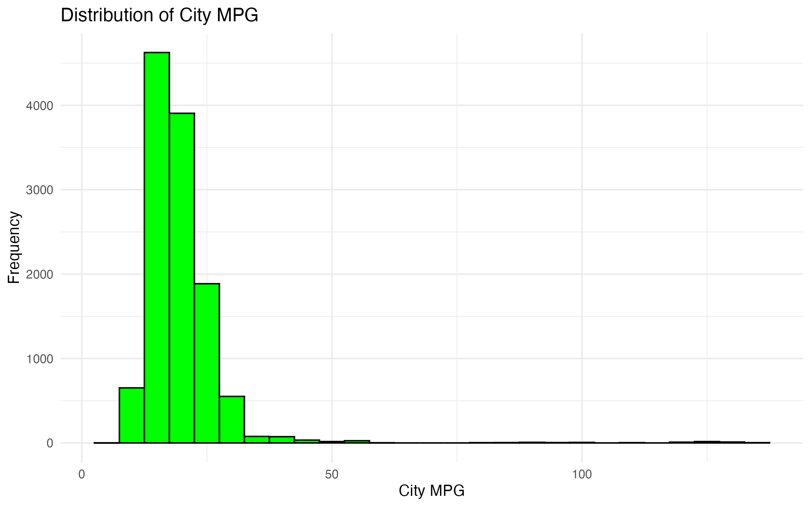
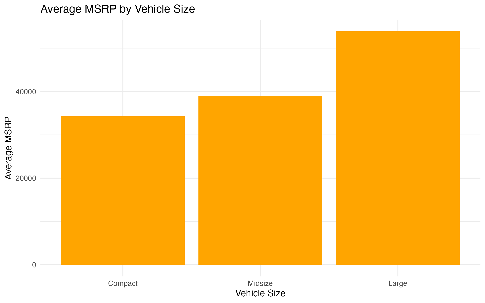

# 🚗 Car Price Analysis – Google Data Analytics Capstone

This project was completed as part of the Google Data Analytics Certificate Capstone.  
It explores which factors influence the Manufacturer's Suggested Retail Price (MSRP) of cars.

---

## 📌 Business Task

**Goal:**  
Help car manufacturers and dealerships understand what drives vehicle prices and identify opportunities to optimize offerings.

**Key questions:**
- What features are most correlated with MSRP?
- Do vehicle type, fuel system, or horsepower affect price?
- How can this insight inform pricing strategy?

---

## 📊 Dataset

- Source: `car_data.csv`
- Size: 11,914 rows × 16 columns
- Key features:
  - Engine HP
  - Engine Cylinders
  - Fuel Type
  - Vehicle Size & Style
  - MSRP (target variable)

---

## 🛠️ Tools & Process

- Python (pandas, numpy): Data cleaning
- R (ggplot2, corrplot): Data visualization
- Jupyter Notebook: Analysis workflow
- Git/GitHub: Version control

**Process steps:**
1. Ask
2. Prepare
3. Process
4. Analyze
5. Share
6. Act

---

## 📈 Visual Insights

### Distribution of City MPG  

### Average MSRP by Vehicle Size  

### Engine HP vs MSRP (log)  

### Correlation Matrix  

---

## ✅ Key Findings

- Engine HP has the strongest positive correlation with MSRP
- Compact and midsize vehicles dominate the affordable segment
- Vehicle size, engine specs, and drivetrain influence pricing more than brand popularity

---

## 📌 Recommendations

- Focus product line on mid-HP, midsize vehicles
- Offer compact models with high HP for value seekers
- Use fuel type + drivetrain as pricing signals

---

## 🖼️ Presentation

The final slides are available here:  
[📄 View Presentation (PDF)](presentation/Capstone_keynote.pdf)

---

## 👤 Author

**Sebastian Bangemann**  
[LinkedIn](https://www.linkedin.com/in/sebastian-bangemann/))  
[GitHub](https://github.com/seb-bange)

---
